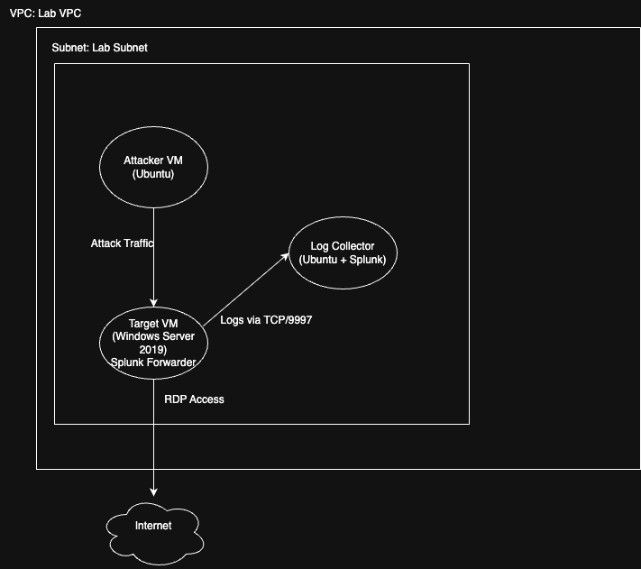

# SIEM Internship - Phase 1: Foundation Setup

This repository documents the progress and findings for Phase 1 of the SIEM Internship.

## Lab Architecture

This diagram illustrates the logical and physical layout of the personal cybersecurity lab environment, including the attacker machine, target, and SIEM collector, all residing within the same AWS VPC and subnet.

### Network Configuration:
* All instances are within a single AWS VPC and a common private subnet.
* Security Groups are configured to allow:
    * Inbound SSH (Port 22) from personal IP to Ubuntu instances.
    * Inbound RDP (Port 3389) from personal IP to Windows instance.
    * Inbound RDP (Port 3389) from the Attacker EC2 instance to the Windows Target.
    * Inbound Splunk Forwarder traffic (e.g., Port 9997 or 8089) from the Windows Target to the Splunk Collector.
    * Outbound access from all instances as needed for updates and general connectivity.

## Tools Used

* **Cloud Platform:** AWS EC2 (Free Tier)
* **SIEM:** Splunk Free/Developer Edition (on Ubuntu 22.04 LTS)
* **Log Forwarding:** Splunk Universal Forwarder (on Windows Server 2019)
* **Operating Systems:**
    * Ubuntu 22.04 LTS (for Splunk Collector)
    * Ubuntu 22.04 LTS (for Attacker Machine)
    * Windows Server 2019 (for Target Machine)
* **Attack Tools:** Hydra (for RDP brute force)
* **Diagramming Tool:** draw.io (diagrams.net)

## Scenarios

Details for each detection scenario will be documented under the `writeups/` directory.